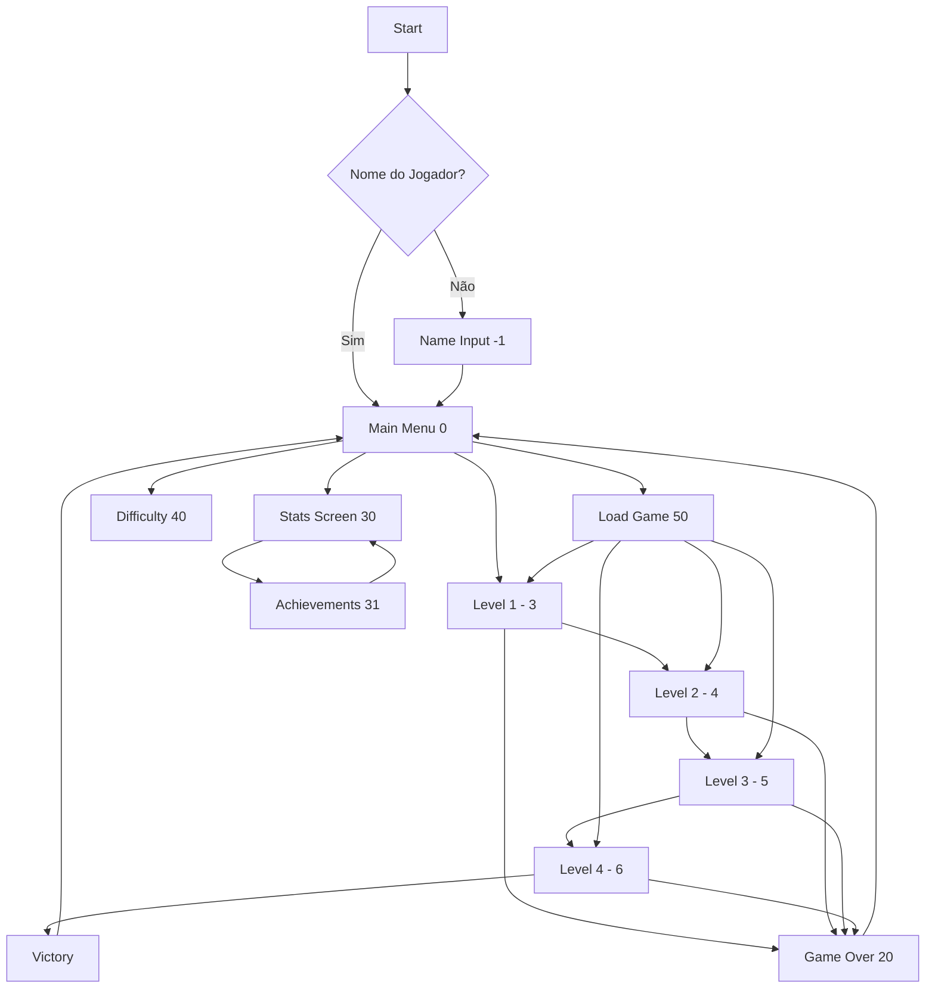

# 🎮 Fluxo do Jogo

## 📋 Visão Geral

Este documento descreve o fluxo completo do jogo, desde a inicialização até os diferentes estados e transições possíveis.

## 🚀 Inicialização

### 1. **Startup Sequence**
```
main.py
├── pygame.init()
├── GraphicsManager (configurações de tela)
├── Game.__init__()
│   ├── Carregar assets
│   ├── Inicializar managers
│   ├── Criar níveis
│   └── Configurar estado inicial
└── game.run() → Game Loop
```

### 2. **Estado Inicial**
- Se não há nome do jogador → `game_state = -1` (Name Input)
- Se já existe nome → `game_state = 0` (Main Menu)

## 🔄 Diagrama de Estados



## 📊 Estados do Jogo

### Estados Principais

| ID | Estado | Descrição |
|----|--------|-----------|
| -1 | Name Input | Entrada do nome do jogador |
| 0 | Main Menu | Menu principal com opções |
| 3 | Level 1 | Floresta - Fase tutorial |
| 4 | Level 2 | Labirinto - Exploração |
| 5 | Level 3 | Fortaleza - Combate intenso |
| 6 | Level 4 | Boss Final |
| 20 | Game Over | Tela de derrota |
| 30 | Stats Screen | Estatísticas do jogador |
| 31 | Achievements | Tela de conquistas |
| 40 | Difficulty | Seleção de dificuldade |
| 50 | Load Game | Carregar jogo salvo |
| 51 | Save Game | Salvar progresso |

## 🎬 Fluxo Detalhado

### 1. **Entrada no Jogo**

#### Primeiro Acesso
```
1. Name Input Screen
   - Digite o nome
   - Pressione ENTER
   
2. Main Menu
   - Animação de entrada
   - Música tema
   - Opções disponíveis
```

#### Acessos Posteriores
```
1. Main Menu direto
   - Nome já salvo
   - Estatísticas carregadas
```

### 2. **Menu Principal**

#### Opções Disponíveis
- **🎮 JOGAR**: Inicia/continua o jogo
- **📊 ESTATÍSTICAS**: Ver progresso (S)
- **⚙️ DIFICULDADE**: Ajustar nível (D)
- **💾 CARREGAR**: Load game (L)
- **🏆 CONQUISTAS**: Via stats screen
- **❌ SAIR**: Fecha o jogo

#### Controles Adicionais
- **1-4**: Ir direto para fases (debug)
- **M**: Mute audio
- **↑↓**: Ajustar volume
- **Alt+Enter**: Fullscreen
- **G**: Configurações gráficas

### 3. **Progressão das Fases**

#### Level 1 - Floresta
```
1. Story Screen (phase_1)
   - Introdução narrativa
   - Background contextual
   
2. Gameplay
   - Tutorial de movimento
   - Combate básico
   - Coleta de orbes
   
3. Conclusão
   - Auto-save
   - Transição para Level 2
```

#### Level 2 - Labirinto
```
1. Story Screen (phase_2)
   - Continuação da história
   
2. Gameplay
   - Exploração de labirinto
   - Puzzles simples
   - Novos inimigos
   
3. Conclusão
   - Auto-save
   - Transição para Level 3
```

#### Level 3 - Fortaleza
```
1. Story Screen (phase_3)
   - Aproximação do objetivo
   
2. Gameplay
   - Sistema de chaves (3 necessárias)
   - Minimapa (TAB)
   - Combate intensificado
   
3. Conclusão
   - Auto-save
   - Transição para Level 4
```

#### Level 4 - Boss Final
```
1. Story Screen (phase_4)
   - Confronto final
   
2. Gameplay
   - Batalha épica
   - Todos os recursos disponíveis
   
3. Vitória
   - Story Screen (victory)
   - Retorno ao menu
   - Estatísticas finais salvas
```

### 4. **Game Over**

#### Triggers
- Vida do jogador chega a 0
- Disponível em qualquer fase

#### Opções
- **ENTER/SPACE**: Retornar ao menu
- **Cheats**: Pular para fases específicas

### 5. **Sistema de Save/Load**

#### Auto-Save
- Ao completar cada fase
- Slot 0 reservado
- Sobrescreve automaticamente

#### Quick Save (F5)
- Salva estado atual
- Usa slot 0 (auto-save)
- Feedback visual

#### Save Manual (F6)
- Interface com 5 slots
- Nome customizado
- Preview de informações

#### Load (F9 ou Menu)
- Lista saves disponíveis
- Mostra progresso/tempo
- Confirmação antes de carregar

## 🎯 Condições de Vitória/Derrota

### Vitória
1. Completar Level 4
2. Derrotar o boss final
3. Ver história de conclusão

### Derrota
1. Vida chega a 0
2. Game Over screen
3. Opção de retry

## 🔀 Transições Especiais

### Story Screens
- Aparecem antes de cada fase
- Podem ser puladas com SPACE/ENTER
- Background temático por fase

### Loading Screen
- Entre transições maiores
- Background padrão
- Não há loading real (decorativo)

## 🎮 Controles Durante o Jogo

### Globais (Sempre Ativos)
- **Alt+Enter**: Toggle fullscreen
- **M**: Mute/unmute
- **↑↓**: Volume
- **F5**: Quick save
- **F9**: Quick load
- **F6**: Save screen

### In-Game
- **WASD/Arrows**: Movimento
- **Shift**: Correr
- **Space**: Atacar
- **Q**: Trocar arma
- **E**: Trocar magia
- **TAB**: Minimapa (Level 3)

### Debug/Cheats
- **F1-F4**: Ir para levels
- **1-4** (menu): Ir para levels

## 📈 Progressão e Persistência

### Dados Salvos
1. **Progresso**
   - Fase atual
   - Fases completadas
   - Posição no mapa

2. **Estatísticas**
   - Tempo de jogo
   - Inimigos derrotados
   - Itens coletados
   - Deaths count

3. **Inventário**
   - Orbes coletados
   - Chaves
   - Arma/magia atual

4. **Configurações**
   - Volume
   - Dificuldade
   - Gráficos

## 🚦 Fluxo de Eventos

### Event Loop
```python
while running:
    # 1. Captura eventos
    events = pygame.event.get()
    
    # 2. Processa por prioridade
    - System events (QUIT)
    - Cheats (debug)
    - Audio controls
    - Game state events
    
    # 3. Atualiza estado
    - Entities
    - UI
    - Animations
    
    # 4. Renderiza
    - Background
    - Sprites (Y-sort)
    - UI overlay
    - Effects
    
    # 5. Frame control
    clock.tick(fps_limit)
```

## 🎨 Feedback Visual

### Indicadores de Estado
- **Health Bar**: Vida atual
- **Energy Bar**: Energia para correr/magia
- **Weapon Icon**: Arma selecionada
- **Key Counter**: Chaves coletadas
- **Minimap**: Localização (Level 3)

### Transições
- **Fade In/Out**: Entre telas
- **Story Screens**: Narrativa visual
- **Death Animation**: Ao morrer
- **Victory Effects**: Ao vencer

---

[← Voltar: Padrões de Design](./padroes-design.md) | [Índice](./README.md) | [Próximo: Sistema de Combate →](./sistemas/combate.md)